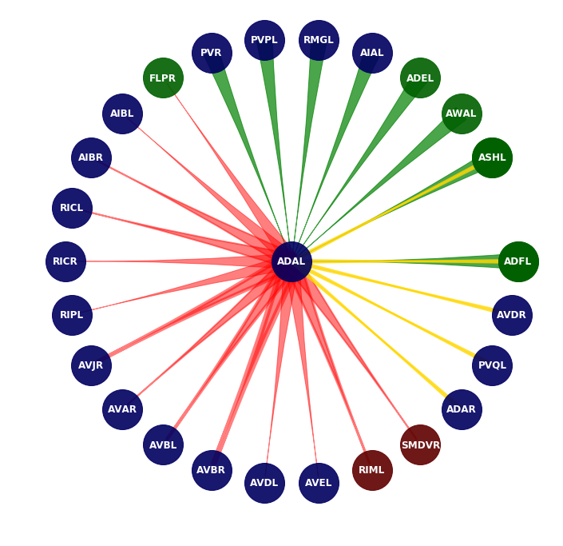
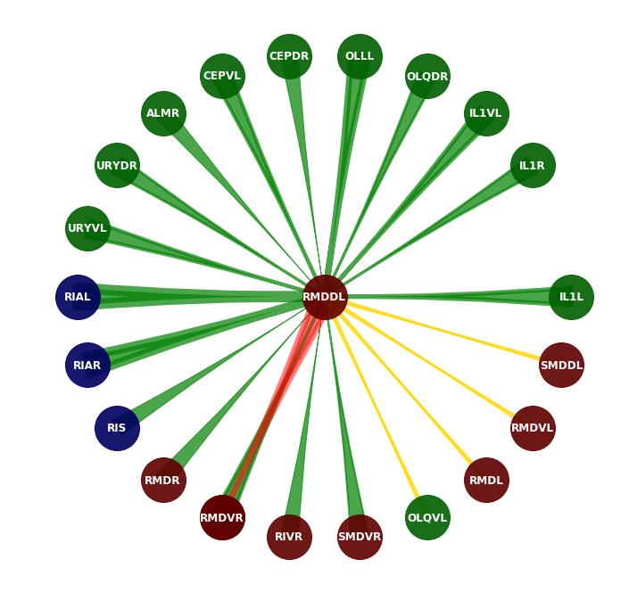
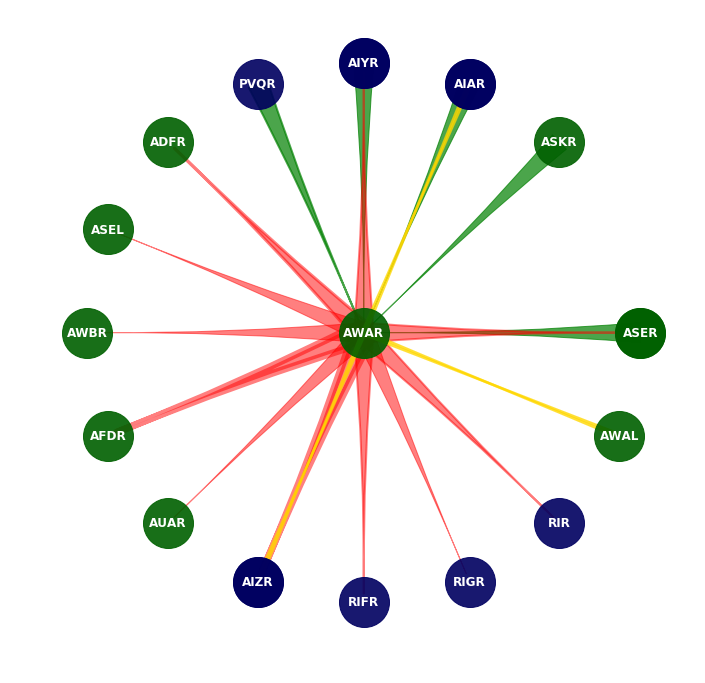

# Connectome Visualizer

<p align="center">
  	
	
	
</p>

## Installation

- Install Python and [jupyter notebook](https://jupyter.org/install)
- Download :

```
git clone https://github.com/MarcusJP/WormConnectome.git
```

- Install the libraries :

```
pip install numpy pandas networkx matplotlib ipywidgets
```

## Usage

- Launch in the folder :

```
jupyter notebook
```

- Open Connectome Visualizer.ipynb

- Press SHIFT + ENTER to run the cells


