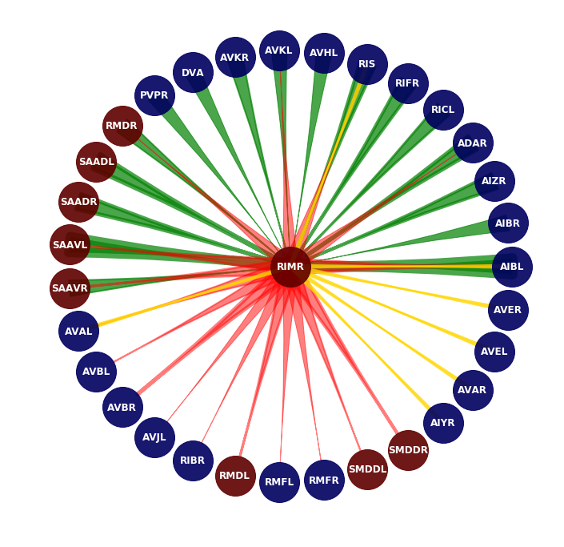

# Connectome Visualizer

- Individual neural connections
<p align="center">
  	
	
	
</p>

- Whole connectome visualization
<p align="center">
  	
</p>

## Installation

- Install [Python](https://www.python.org/downloads/) and [jupyter notebook](https://jupyter.org/install)
- Download :

```
git clone https://github.com/MarcusJP/WormConnectome.git
```
(or just download the .zip)

- Install the libraries :

```
pip install numpy pandas networkx matplotlib ipywidgets pyqt5
```

## Usage

### GUI for single neurons visualization

- Run the following command :

```
python3 single_conn.py
```

### Single neurons and whole circuit with jupyter notebook

- Launch in the folder :

```
jupyter notebook
```

- Open Connectome Visualizer.ipynb

- Press SHIFT + ENTER to run the cells


